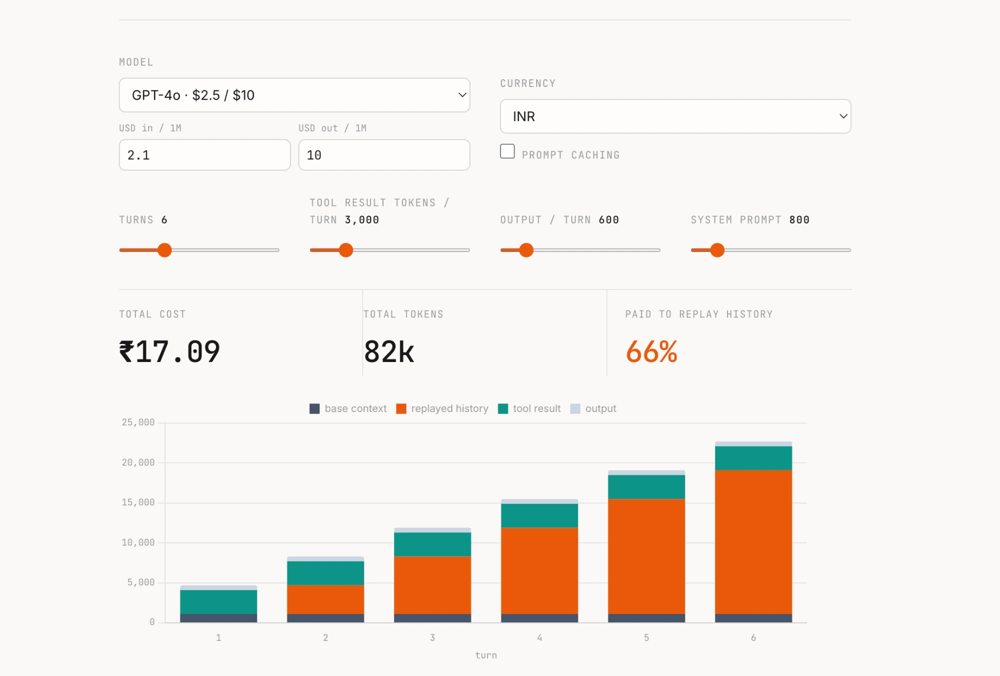

# agent-cost

**Why do tool-calling agents get so expensive?** Because a multi-turn agent resends the
*entire conversation* every turn — so input tokens **compound**, and cost grows
**quadratically** with the number of turns, not linearly. Most "why is my agent bill so
high?" surprises come down to this one fact (plus fat tool results that get replayed).

`agent-cost` is a tiny, dependency-free web tool that makes it visible.

### ▶ Live: https://akrishnash.github.io/agent-cost/



---

## What it shows

- A **per-turn breakdown** of where tokens go: base context, **replayed history** (the
  villain), tool results, and output.
- **Total cost** in 12 major currencies (USD, INR, EUR, GBP, JPY, CNY, SGD, AUD, CAD, AED,
  BRL, KRW) with live exchange rates.
- The share of your bill that is **pure history replay**.
- The effect of **prompt caching** and **tool-result truncation** — the two highest-leverage
  cost fixes.
- A **shareable URL** that encodes your scenario.

## The math

At turn `t`, the model receives the system prompt plus everything before it:

```
input(t) = base + (t-1)·(output + tool_result) + tool_result
```

Summed over `N` turns, the replayed-history term grows like `N²`. Output is billed once per turn.

## Run it locally

It's a single static HTML file — no build, no backend, no keys.

```bash
git clone https://github.com/akrishnash/agent-cost.git
cd agent-cost
python -m http.server 8000   # then open http://localhost:8000
```

## Add your own model

Model presets live in one array near the top of the `<script>` in `index.html`:

```js
const MODELS=[
  {n:"GPT-4o", in:2.50, out:10.00},   // USD per 1M tokens
  // add yours here:
  {n:"My model", in:1.00, out:3.00},
];
```

PRs adding current model prices are welcome.

## Notes

- Provider prices are entered in **USD** (how they're billed) and are **editable** — set them
  to match current pricing.
- Currency conversion uses approximate live rates; this is a **client-side estimate**, not a
  billing guarantee.

## License

MIT — see [LICENSE](LICENSE).

---

Built by [Anurag K. Sharma](https://akrishnash.github.io) · part of a small set of tools for
understanding LLM agents in production ([anomaly-detection](https://github.com/akrishnash/anomaly-detection)).
